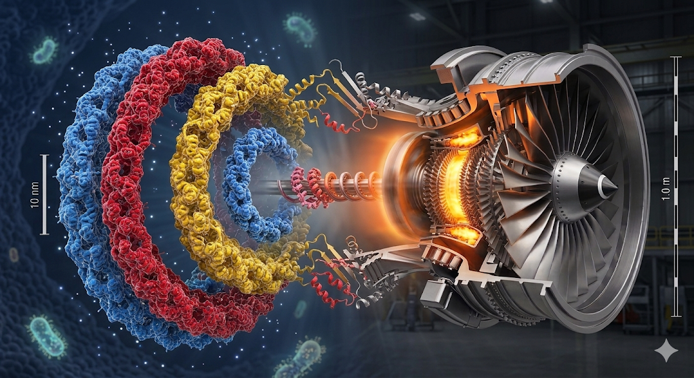

<p align="center">
  
</p>

<h1 align="center">CrossGen</h1>

<p align="center">
  <strong>Cross-Domain Idea Generator</strong><br>
  Give it a problem. It finds solutions from unrelated fields — not by keyword matching,<br>
  but by mapping the <em>structure</em> of how things work across domains.
</p>

<p align="center">
  <a href="#quick-start">Quick Start</a> · <a href="#how-it-works">How It Works</a> · <a href="#what-makes-it-interesting">Why It's Different</a>
</p>

---

## How It Works

A 6-stage pipeline that treats analogy as a rigorous transfer mechanism, not a creativity gimmick.

```
                        "How can we reduce hospital readmission rates?"
                                            │
                                ┌───────────┴───────────┐
                                │   1. DECOMPOSE         │
                                │   functions, constraints│
                                │   contradictions, hooks │
                                └───────────┬───────────┘
                                            │
               ┌────────────────────────────┼────────────────────────────┐
               │              2. ABSTRACT (4 parallel lenses)            │
               │                                                         │
               │  ┌──────────┐ ┌──────────┐ ┌──────────┐ ┌───────────┐  │
               │  │ SAPPhIRE │ │Biologize │ │ WordTree │ │   TRIZ    │  │
               │  │ science  │ │ biomimicry│ │ semantic │ │ 40 inv.  │  │
               │  │principle │ │reframings│ │expansion │ │principles │  │
               │  └────┬─────┘ └────┬─────┘ └────┬─────┘ └─────┬─────┘  │
               └───────┼────────────┼────────────┼─────────────┼────────┘
                       └────────────┼────────────┘             │
                                    ▼                          │
                        ┌───────────┴───────────┐              │
                        │   3. EXPAND            │◄─────── 40 universal
                        │   6-8 distant domains  │         principles +
                        │   (biology, arts,      │         42 curated
                        │    earth science...)   │         domains
                        └───────────┬───────────┘
                                    │
          ┌─────────┬─────────┬─────┴─────┬─────────┬─────────┐
          ▼         ▼         ▼           ▼         ▼         ▼
     ┌─────────────────────────────────────────────────────────────┐
     │  4. MINE (parallel per domain)                              │
     │  Gentner's Structure-Mapping Theory:                        │
     │  • map RELATIONS, not surface features                      │
     │  • one-to-one correspondences                               │
     │  • causal → functional → structural → constraint → process  │
     │  • mandatory "where it breaks" (≥3 weak spots)              │
     └────────────────────────┬────────────────────────────────────┘
                              │
     ┌────────────────────────┴────────────────────────────────────┐
     │  5. SYNTHESIZE                                              │
     │  analogy → numbered action steps                            │
     │  + candidate inferences (Gentner)                           │
     │  + testable, falsifiable predictions                        │
     │  + research pointers (Scholar queries, key terms)           │
     └────────────────────────┬────────────────────────────────────┘
                              │
     ┌────────────────────────┴────────────────────────────────────┐
     │  6. EVALUATE                                                │
     │  novelty × feasibility × structural depth × actionability   │
     │  same-domain penalty (0.5×) → ranked solutions              │
     └─────────────────────────────────────────────────────────────┘
```

The core idea: don't ask "what field is similar to mine" — instead, decompose the problem into domain-neutral *relations*, then search for domains where those same relations hold, even if everything on the surface looks completely different.

## The Pipeline

| # | Stage | What happens |
|---|-------|-------------|
| 1 | **Decompose** | Extracts functions, constraints, and contradictions from your problem |
| 2 | **Abstract** | 4 parallel lenses reframe it: SAPPhIRE, Biologize, WordTree, TRIZ |
| 3 | **Expand** | Identifies 6–8 high-distance candidate domains for analogical transfer |
| 4 | **Mine** | Finds structural analogies in each domain (relations, not surface features) |
| 5 | **Synthesize** | Converts analogies into concrete solutions with testable predictions |
| 6 | **Evaluate** | Scores on novelty, feasibility, structural depth, and actionability |

## What Makes It Interesting

- **4 parallel abstraction lenses** — SAPPhIRE (scientific principles), Biologize (biomimicry), WordTree (semantic expansion), and TRIZ (contradiction resolution) all run concurrently
- **Gentner's Structure-Mapping Theory enforced** — the Mining stage maps *relational* correspondences, not surface similarities. One-to-one mappings, systematic chains of relations, causal/functional/structural/constraint/process types
- **Hybrid deterministic + LLM** — TRIZ contradiction matrix and 40 inventive principles are looked up, not hallucinated. The LLM handles what it's good at: reasoning over structure
- **40 universal cross-domain principles + 42 curated domains** — feedback loops, phase transitions, self-organization, catalysis... each tagged with the domains where they appear
- **Mandatory "where it breaks" honesty** — every analogy must state where it fails. The prompt requires at least 3 specific weak spots. Solutions must address them
- **Testable predictions** — outputs Gentner's "candidate inferences": falsifiable predictions that emerge from the structural mapping, not just inspiration

## Quick Start

```bash
# Install
uv sync

# Solve a problem
crossgen solve "How can we reduce hospital readmission rates?"

# JSON output
crossgen solve "How can we reduce hospital readmission rates?" --json

# Browse principles
crossgen principles list
crossgen principles search "feedback"

# Web UI with live streaming
uvicorn web.app:app --host 0.0.0.0 --port 8000
```

## Project Structure

```
src/crossgen/
├── cli.py                 # Typer CLI (solve, principles)
├── models.py              # Pydantic models for all 6 stages
├── pipeline.py            # Async orchestrator + SSE streaming
├── knowledge/
│   ├── domains.py         # 42 curated domains across 8 categories
│   ├── principles.py      # 40 universal cross-domain principles
│   └── triz.py            # 40 TRIZ inventive principles + contradiction matrix
├── llm/
│   ├── client.py          # Claude integration
│   └── prompts.py         # All stage prompt templates
└── stages/
    ├── decompose.py       # Stage 1: functional decomposition
    ├── abstract.py        # Stage 2: 4 parallel lenses
    ├── expand.py          # Stage 3: domain discovery
    ├── mine.py            # Stage 4: structural analogy mining
    ├── synthesize.py      # Stage 5: solution generation
    └── evaluate.py        # Stage 6: scoring & ranking

web/
├── app.py                 # FastAPI + SSE streaming
├── templates/             # Jinja2 templates
└── static/                # CSS + JS

tests/
├── test_pipeline.py
├── test_scoring.py
└── test_stages.py
```

## Tech Stack

Python 3.11+ · FastAPI · Typer · Rich · Pydantic v2 · SSE streaming · Claude

## License

MIT
